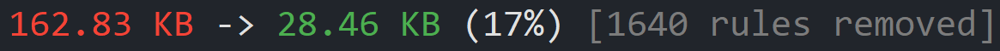

# Cherrypicker

Tool to reduce the size of CSS files by removing unused styles from them.



## Usage
Cherrypicker can be used from a CLI, or via a Webpack loader.

### CLI
Install it globally using npm or Yarn.
```bash
npm install -g cherrypicker-cli

yarn global add cherrypicker-cli
```

Then use the `cherrypicker` command in your project directory.

```bash
cherrypicker index.html css/*.css
```

This will create a `cherrypicked` folder containing the cherrypicked result.

The arguments to the command, which can be in any order, are the files you would like Cherrypicker to consider.

Stylesheets with the `.css` extension will be checked against markup files with the `.html` or `.vue` extensions and any styles that don't appear in the markup will be removed.

Optionally, you can use the `--min` flag to minify the output for a greater size reduction.

### Webpack
Install the loader, and the core library, using npm or Yarn.
```bash
npm install cherrypicker-loader cherrypicker

yarn add cherrypicker-loader cherrypicker
```

After any pre-processors but before `css-loader` add the following rule:
```js
{
  loader: "cherrypicker-loader",
  options: {
    markupFiles: ["*.html"]
  }
}
```

If you only have one set of markup files, you can use a single string instead of an array of them.

Your webpack config should then look something like this:
```js
module.exports = {
    module: {
        rules: [
            {
                test: /\.scss$/,
                use: [
                    "style-loader",
                    "css-loader",
                    {
                        loader: "cherrypicker-loader",
                        options: {
                            markupFiles: ["*.html"]
                        }
                    },
                    "sass-loader"
                ]
            }
        ]
    }
};
```

### Vue CLI
If you're using the new `@vue/cli`, you can add a plugin to modify your production Webpack config to cherrypick your CSS.

```bash
vue add cherrypicker
```